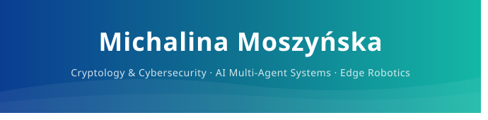

  

 

  
  &nbsp;
  
  &nbsp;
  

---

## About

I'm a Cryptology & Cybersecurity student at the Faculty of Cybernetics, Military University of Technology (WAT) in Warsaw, on an individual study track focused on quantum informatics and artificial intelligence with an emphasis on multi-agent systems.

I build things that have to work in the real world — under latency budgets, on edge hardware, in front of a live audience. My flagship work is **AIWAT**, an autonomous interactive robot whose real-time voice stack I designed and engineered end-to-end; it won the Rector's award for the best student research project and took **1st place at the Students' Cybernetics Symposium 2026**. Alongside AI/robotics, I work in offensive and defensive security: I author and run CTF challenges, study digital forensics and web exploitation, and serve as Secretary of the WAT CyberSecurity Science Club.

I've presented research at national and international conferences (Poland, Romania), trained across Europe through military exchange programmes (EMILYO / Erasmus+ in Romania, Greece and France), and I care about turning hard technical work into something people can actually understand and use.

**Master's thesis (exp. 2027)** — semantic steganography in autoregressive audio generation models (hiding information in the token space of neural audio codecs)  
**Languages** — Polish (native) · English (professional)  
**Graduating** — June 2027 · 5-year integrated Master's, currently 4th year  
**Open to** — AI/ML engineering and applied security roles

---

## Featured Projects

### [WATUS v1](https://github.com/misialyna/watus_project) · [WATUS v2](https://github.com/misialyna/watus_project_2) — Real-time voice & vision stack for an autonomous robot

Award-winning interactive robot deployed at university events. I built the low-latency voice frontend: it listens, recognises who is speaking, transcribes, reasons via an LLM backend, sees its surroundings, and replies out loud — all on edge hardware (NVIDIA Jetson AGX Orin). v2 adds Groq cloud STT, improved Piper TTS integration and a companion [BellaBot web interface](https://github.com/misialyna/interfejs).

| Component | Implementation |
|---|---|
| Speaker verification | ECAPA-TDNN (SpeechBrain) — locks onto a single leader voice |
| Speech-to-text | WebRTC VAD + Faster-Whisper streaming · Groq Whisper API (v2) |
| Object detection | RT-DETR / YOLO (Ultralytics + OpenCV) feeding visual context into each report |
| Reasoning & synthesis | Structured reports pushed to LLM backend over HTTP; Piper neural TTS for reply |
| Architecture | Decoupled, event-driven microservices over ZeroMQ PUB/SUB |

`Python` `C++` `PyTorch` `SpeechBrain` `Faster-Whisper` `Piper` `Groq` `Ultralytics RT-DETR` `ZeroMQ` `FastAPI` `Edge AI`

---

### [AUD1 STT/TTS Benchmark](https://github.com/misialyna/stt-tts-benchmark) — Polish-language speech evaluation toolkit

HTTP benchmark server with a web UI for comparing STT and TTS engines on Polish speech. Includes 25 annotated audio samples across five difficulty categories (everyday, military, phonetic, numbers, complex/noisy) and result tracking with WER and latency metrics.

| Engine | Type | Notes |
|---|---|---|
| Faster-Whisper | STT | Local, models: tiny → large |
| Groq Whisper API | STT | Cloud, whisper-large-v3 |
| Piper TTS | TTS | Local Polish voices: darkman, gosia |
| Supertonic TTS | TTS | API-based |

`Python` `faster-whisper` `Piper TTS` `Groq` `HTML` `Audio processing` `Benchmarking`

---

### CTF 2024/2025 — WAT CyberSecurity Club Competition

Three-challenge CTF suite authored for the 2024/2025 academic competition. Each challenge is self-contained with infrastructure, solution guide, and deployment option.

| Challenge | Repository | Category | Technique |
|---|---|---|---|
| Social Engineering | [ctf-social-engineering](https://github.com/misialyna/ctf-social-engineering) | Phishing analysis | Identify indicators in a phishing email; find a hidden flag in the confirmation page source |
| Web Exploitation | [ctf-web-exploitation](https://github.com/misialyna/ctf-web-exploitation) | Command injection + file upload | Flask app with intentional RCE via `subprocess` and unrestricted upload endpoint |
| Network Exploitation | [ctf-network-exploitation](https://github.com/misialyna/ctf-network-exploitation) | HTTP header manipulation | Forge `X-Forwarded-For` to spoof a privileged IP and access the admin panel |

`Python` `Flask` `HTML/CSS` `Web Security` `CTF Design` `Network Exploitation`

---

### CTF 2025/2026 — Multi-stage chained challenge

A four-part chained CTF authored for the 2025/2026 academic competition. Solving each stage unlocks the next — from cryptography and algebra through a phishing bank login to OSINT and steganography.

| Stage | Repository | Category | Technique |
|---|---|---|---|
| 1 — Encrypted Trail | [ctf-szyfrowany-trop](https://github.com/misialyna/ctf-szyfrowany-trop) | Cryptography + logic | Base64 decoding, solve a system of linear equations to derive login credentials |
| 2 — Phishing Bank | [ctf-falszywy-bank](https://github.com/misialyna/ctf-falszywy-bank) | Web security | Analyse HTML source, find a hidden Base64 comment, authenticate with credentials from stage 1 |
| 3 — The Spy | [ctf-the-spy](https://github.com/misialyna/ctf-the-spy) | OSINT | Analyse a certificate image, locate the subject on social media, decode a hidden message |
| 4 — Landscape | [ctf-landscape](https://github.com/misialyna/ctf-landscape) | Steganography | Extract a hidden flag from image metadata via `exiftool` |

`Python` `Flask` `HTML/CSS` `CTF Design` `Steganography` `OSINT` `Cryptography`

---

## Tech Stack

**Languages**

**AI / ML & NLP**

**Speech, Audio & Vision**

**Cybersecurity**

**Infrastructure & Tooling**

<b>Full skill matrix</b>

 

**AI / ML / NLP** — PyTorch · scikit-learn · Hugging Face · Transformers · autoregressive & diffusion models · LLM orchestration · RAG · embeddings, semantic & vector search · prompt engineering · agentic / multi-agent systems · CNNs · federated learning · model evaluation · inference optimization (CPU/GPU/MPS) · local & edge deployment · ONNX Runtime

**Speech / Audio AI** — SpeechBrain · ECAPA-TDNN · speaker verification & diarization · WebRTC VAD · Faster-Whisper / OpenAI Whisper (STT) · Piper / VITS / XTTS-v2 / Kokoro (TTS) · audio signal processing (PCM/WAV, sample rate, mono) · librosa · soundfile · audio benchmarking

**Computer Vision / Robotics / Edge** — Ultralytics RT-DETR & YOLO · OpenCV · Raspberry Pi · NVIDIA Jetson AGX Orin · sensor / camera / LiDAR integration · IoT basics · edge AI

**Cybersecurity** — CTF challenge design & testing (picoCTF, OverTheWire, Hack The Box, TryHackMe, Google CTF) · web exploitation · command injection · insecure file upload · HTTP header manipulation · network traffic / PCAP analysis (Wireshark) · OSINT · digital forensics · Nmap · Burp Suite · Linux privilege-escalation basics · Windows security basics

**Cryptography** — classical & public-key cryptography · RSA · hashing (MD5) · PKI & certificates · GPG / encryption · OpenVPN · endpoint encryption

**Data engineering & analysis** — pandas · NumPy · EDA · data cleaning · feature engineering · PCA · K-means · data visualisation (matplotlib, ggplot2) · SQL / NoSQL · SQL Server · star-schema & dimensional modelling · data-warehouse design · OLAP · ETL basics · ChromaDB / FAISS / vector DBs

**Architecture & engineering practice** — event-driven & microservice architecture · ZeroMQ PUB/SUB & IPC · WebSocket streaming · REST API design & integration · half-duplex voice interaction · multi-modal & scenario-based agent systems · Architecture Decision Records (ADR) · R&D spike methodology · benchmark engineering · code review · technical & research documentation · BPMN / process modelling

**Tooling & environments** — Git / GitHub (branching, PRs) · Docker & Docker Compose · Kubernetes · Linux / Ubuntu · macOS (Apple Silicon MPS) · VS Code · PyCharm / IntelliJ · RStudio · Jupyter · venv / conda · uv / pip / npm / pnpm · Tailscale / VPN · YAML · Markdown · Regex · JSON / CSV / WAV · unit & basic software testing

**Scientific computing & math** — SageMath · MATLAB · numerical methods · LU decomposition · regression & trend modelling · statistical inference · simulation methods

---

## Selected Achievements

| Year | Award |
|---|---|
| 2026 | **1st place** — Students' Cybernetics Symposium (SCS) 2026, situational awareness in AIWAT |
| 2026 | **Rector's Award** — best student research project in a science club (AIWAT / "Waciak") |
| 2026 | **Letter of commendation** from the Rector-Commandant for outstanding scientific achievement at home and abroad |
| 2026 | **3rd place** — "Military Sciences & Information", 48th Cadet-Nav Scientific Conference, Naval Academy "Mircea cel Bătrân", Romania |
| 2025 | **2nd place** — Students' Cybernetics Symposium (SCS) 2025, HelpDesk project |
| 2025 | Certificate for contribution to the academic community & student research movement |
| 2025 | Top annual assessment (6/6) · distinguished-student invitation to Cadet Day at the Belweder Palace |
| ongoing | Secretary of the WAT CyberSecurity Science Club — co-organiser of CTF competition & conferences |

<b>Talks, conferences & leadership</b>

 

**Research presentations**

- Lecture on building information advantage with AI technology — scientific seminar of the Doctrine & Training Centre of the Polish Armed Forces (Mar 2026)
- Speaker at the WCY WAT academic-year inauguration (Oct 2025) and WCY alumni reunion (Sep 2025)
- Presented AIWAT at the 60th-anniversary gala of the Cybernetics Interest Club (Dec 2025)
- First research talk at the inaugural Students' Cybernetics Symposium — hypercomplex numbers in programming
- Participant, XXX PTSK Scientific Workshops — "Simulation in Research & Development" (May 2026)

**Organisation & leadership**

- Secretary, WAT CyberSecurity Science Club — authored CTF challenges, deputy of the SCS conference organising committee, organiser of the club's 60th-anniversary gala
- Supervised international delegations (Romania, Norway, Greece, Ukraine, Latvia) at the WAT Commando Half-Marathon
- Runs the club's LinkedIn and writes cybersecurity articles for WAT outlets

**International training & exchange (EMILYO / Erasmus+)**

- Romania — International Students' Week + SECOSAFT & CADET INOVA conferences
- Greece — Summer Military Training Programme (land navigation, field medicine, naval ops, fire support)
- France — Common Security & Defence Policy training, Air & Space Force Academy (Mar 2026)

---

## GitHub Stats

  
  

---

  I'm always glad to talk about applied AI, voice & edge systems, robotics and security.  
  

 
